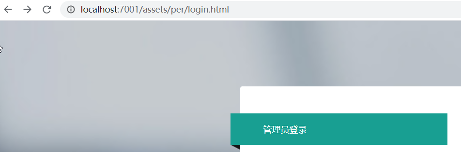

# 项目还在完善中！！
 项目框架使用 spring boot  mybatis  shiro  tk.mybatis mysql  layui 
 
 src/main 是后台文件,css一直到per都是前端文件夹，放在一个地方就行，项目是前后端分离项目。

# 一、环境 
1.redis 3
要在application.properties配置文件中输入redis地址
    
    spring.redis.shiro.host= 
    spring.redis.host= 
    
2.mysql5.7
    
3.nginx 
     要配置好前端文件位置，还有后台接口的拦截
    例如  
  
 

  

       
       server {
            listen       7001;
            server_name  localhost;
       location / {
            root   D:/dev2/layuimini-master/boot/1111/assets/;
            index  index.html  ;
        }
    	
    	 location /css/ {
            root   D:/dev/htmlCode/big/assets/;           
        }
    	 location /js/ {
            root   D:/dev/htmlCode/big/assets/;   
        }
    	 location /assets/ {
            root   D:/dev/htmlCode/big/;   
        }
    	 
    	 location /auth/ {
             proxy_pass   http://127.0.0.1:7003/per/;    
        }
        
        }

​		 
​       

# 二 、演示

**1.菜单管理，配置左侧的菜单项**

**2.在角色管理 模块配置每个角色对应的菜单**

**3.分配菜单**

**4.分配角色对应的权限**

**5.账号管理。给用户分配角色，那么用户就有了菜单和权限**

**6.分配用户的角色**

# 三、例子

**1.例如 给onlyInsert分配菜单（如下菜单），分配权限（增加权限）**

**2.onlyInsert角色的账号登陆后菜单就如图所示。**

**3.没有权限的提示**

